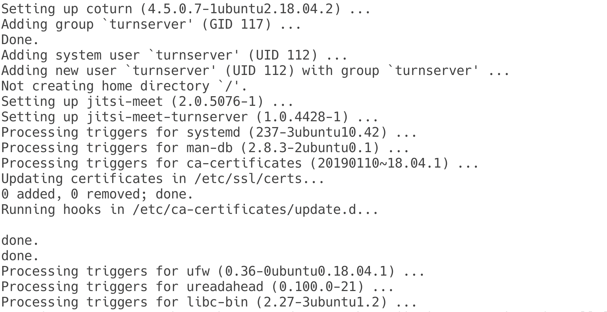
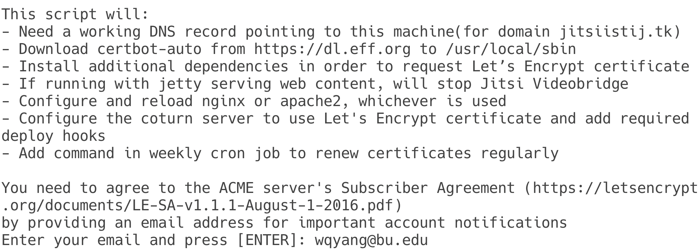
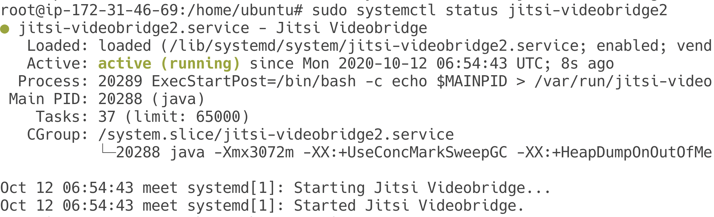
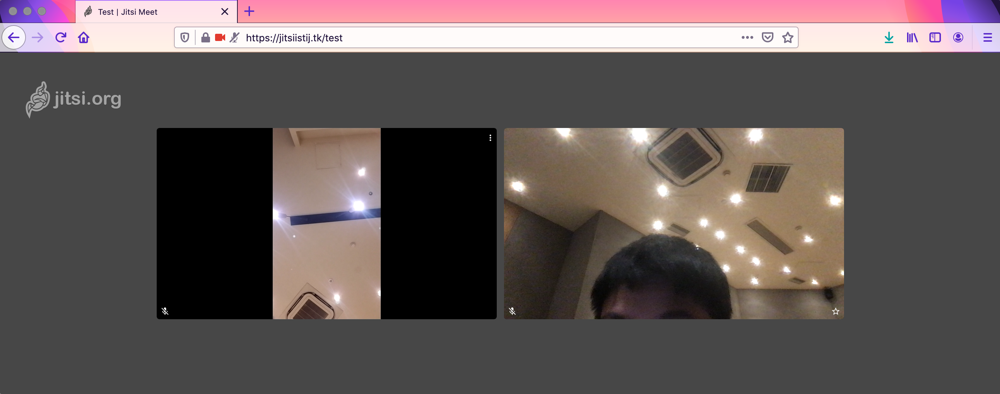

# EC601-Project3

Wenqiang Yang (U90452596)

[toc]

Deploy Jitsi Meet, analyze signaling, and find security holes in session creation.

## Overview

Jitsi is an open source, multi-platform, conferencing service. It is based on WebRTC technology.

## Deploy Own Jitsi Meet Server

To better analyze WebRTC signaling and find security holes in session creation, I first deployed a own Jitsi server. 

According to the official [Self-Hosting Guide](https://jitsi.github.io/handbook/docs/devops-guide/devops-guide-quickstart)^[1]^, we need a Debian-based server. In my delpoyment, I chose AWS EC2 service. I created a AWS EC2 instance, and configured its SSH Key Pairs (to get access to the server from my laptop via SSH),  inbound rules (to allow some traffic to the server), and then allocated an elastic IP to the EC2 instance. The configuration was partly under instruction of [Getting started with Jitsi, an open source web conferencing solution](https://aws.amazon.com/blogs/opensource/getting-started-with-jitsi-an-open-source-web-conferencing-solution/)^[2]^. 

As the default AWS public domain was on the blocklist of *Let's Encrypt*,^[3]^ which is needed to create TLS certificate for encrypted communication, I got a new domain *jitsiistij.tk*, and configure the Elastic IP to it.

After setting up DNS and Fully Qualified Domain Name (FQDN), I installed Jitsi Meet.

``` bash
curl https://download.jitsi.org/jitsi-key.gpg.key | sudo sh -c 'gpg --dearmor > /usr/share/keyrings/jitsi-keyring.gpg'
echo 'deb [signed-by=/usr/share/keyrings/jitsi-keyring.gpg] https://download.jitsi.org stable/' | sudo tee /etc/apt/sources.list.d/jitsi-stable.list > /dev/null

sudo apt update

sudo apt install jitsi-meet
```

The installation was quite automated, and seeing this (Fig1) showed that we successfully installed Jisti-Meet on our server.

<div style="text-align:center">
	
  <div>
    Fig1. Jitsi Installation
  </div>
</div>

Then I run the `/usr/share/jitsi-meet/scripts/install-letsencrypt-cert.sh` script, and created Lets-Encrypt Certificate.

 <div style="text-align:center">
	
  <div>
    Fig2. TLS Certificate
  </div>
</div>

After that, the installation and certificate configuration is completed, we can use `sudo service jitsi-videobridge [start|stop|status]` to start/stop or check its current status.

 <div style="text-align:center">
	
  <div>
    Fig3. Service Established
  </div>
</div>

Now, we can visit https://jitsiistij.tk/ to start a video conference (like Fig4 do). This website appears the same as https://meet.jit.si, but https://jitsiistij.tk/ runs on my own AWS EC2 server, which helps us to do further analyses about the signaling procedure and more.

 <div style="text-align:center">
	
  <div>
    Fig4. DEMO
  </div>
</div>


## Reference

[1] Jitsi, "Self-Hosting Guide - Debian/Ubuntu server", October, 2020,*Updated*, https://jitsi.github.io/handbook/docs/devops-guide/devops-guide-quickstart

[2] Ricardo Sueiras, "Getting started with Jitsi, an open source web conferencing solution", March, 2020, https://aws.amazon.com/blogs/opensource/getting-started-with-jitsi-an-open-source-web-conferencing-solution/

[3] pfg, "Policy forbids issuing for name on Amazon EC2 domain", April, 2016 https://community.letsencrypt.org/t/policy-forbids-issuing-for-name-on-amazon-ec2-domain/12692

