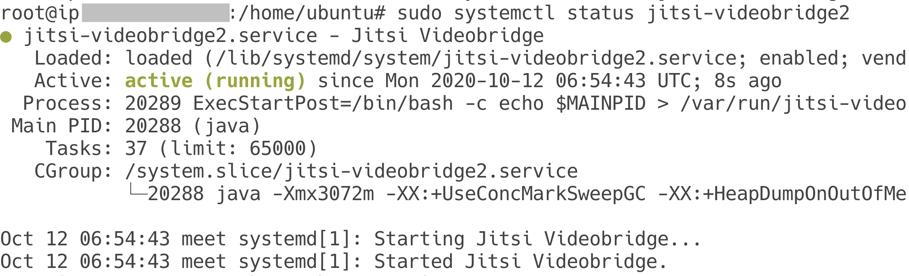

# EC601-Project3

Wenqiang Yang (U90452596)

*GitHub didn't support some markdown grammars, for a better view, please see **Project3.pdf***

[toc]

Deploy Jitsi Meet, analyze signaling, and find security holes in session creation.

## I. Overview

Jitsi is an open source, WebRTC based, conferencing service. It supports multiple platforms, including web, iOS and Android. Also, Jitsi is flexible and scalable. It allows users to deloy, customize, and modify their own Jitsi service, both from front-end and back-end.

Jitsi mainly contains six parts, Jitsi Meet, Jitsi Videobridge, Jitsi Conerence Focus (jicofo), Jitsi Gateway to SIP (jigasi), Jibri, and an external software, Prosody. ^[0]^ In this project, we will analyze the signaling and session initialization, so we mainly focus on the Jitsi Meet, Jitsi Videobridge, and Prosody. Here is a brief introduction.^[0],[1]^

- Jitsi Meet: Web application that uses Jitsi Videobridge to provide users with media data. 
- Prosody: XMPP server that deals with singaling for WebRTC. From network perspective, it receives data from Nginx on port 5280, and communicates with Jicofo and Jitsi Videobridge.
- Jitsi Videobridge: Server-side application that routes multiple video streams. It communicates with Prosody on port 5347, and after the peer-to-peer connection is established, it transfer data with the other user via TCP/4443 or UDP/10000.

## II. Deploy Own Jitsi Meet Server

To better analyze WebRTC signaling and find security holes in session creation, I first deployed a own Jitsi server. 

According to the official [Self-Hosting Guide](https://jitsi.github.io/handbook/docs/devops-guide/devops-guide-quickstart)^[2]^, we need a Debian-based server. In my delpoyment, I chose AWS EC2 service. I created a AWS EC2 instance, and configured its SSH Key Pairs (to get access to the server from my laptop via SSH),  inbound rules (to allow some traffic to the server), and then allocated an elastic IP to the EC2 instance. The configuration was partly under instruction of [Getting started with Jitsi, an open source web conferencing solution](https://aws.amazon.com/blogs/opensource/getting-started-with-jitsi-an-open-source-web-conferencing-solution/)^[3]^. 

As the default AWS public domain was on the blocklist of *Let's Encrypt*,^[4]^ which is needed to create TLS certificate for encrypted communication, I got a new domain *jitsiistij.tk*, and configure the Elastic IP to it.

After setting up DNS and Fully Qualified Domain Name (FQDN), I installed Jitsi Meet.

``` bash
curl https://download.jitsi.org/jitsi-key.gpg.key | sudo sh -c 'gpg --dearmor > /usr/share/keyrings/jitsi-keyring.gpg'
echo 'deb [signed-by=/usr/share/keyrings/jitsi-keyring.gpg] https://download.jitsi.org stable/' | sudo tee /etc/apt/sources.list.d/jitsi-stable.list > /dev/null

sudo apt update

sudo apt install jitsi-meet
```

The installation was quite automated, and seeing this (Fig1) showed that we successfully installed Jisti-Meet on our server.

<div align="center">
	
  <div>
    Fig1. Jitsi Installation
  </div>
</div>

Then I run the `/usr/share/jitsi-meet/scripts/install-letsencrypt-cert.sh` script, and created Lets-Encrypt Certificate.

 <div align="center">
	
  <div>
    Fig2. TLS Certificate
  </div>
</div>

After that, the installation and certificate configuration is completed, we can use `sudo service jitsi-videobridge [start|stop|status]` to start/stop or check its current status.

<div align="center">
	
  <div>
    Fig3. Service Established
  </div>
</div>

Now, we can visit https://jitsiistij.tk/ to start a video conference (like Fig4 do). This website appears the same as https://meet.jit.si, but https://jitsiistij.tk/ runs on my own AWS EC2 server, which helps us to do further analyses about the signaling procedure and more.

 <div align="center">
	
  <div>
    Fig4. DEMO
  </div>
</div>


## III. Signaling Analysis

### i. Signaling in theory

To establish direct peer-to-peer connections, clients need to exchange some important information, which is called Session Description information, to negotiate about transport information, media type, encryption configuration, etc. The transmission of these information is called signaling. Signaling takes place between client and server, between server and server.

WebRTC doesn't specify how to control the signaling plane, and applications can use existing signaling protocals, such as XMPP or SIP. For Jitsi, it uses XMPP protocol for signaling. To be specific, it uses Prosody as a XMPP communication server.

### ii. Signaling in practice

I used TShark to analyze the real signaling process. TShark is a commandline tool that can listen to and capture network packets. It has similar functions to tcpdump but more powerful and more user-friendly. 

After installing it, I firstly used `tshark -i eth0 -r capture1.pcap -a duration:60` to monitor traffic packets for 60 seconds and save raw data to `capture1.pcap`. Meanwhile, I was using two device to test the WebRTC meeting on jitsiistij.tk. I forced WebRTC to use proxy so my two devices has different IP addresses. 

Then I used `tshark -r capture1.pcap > tshark_output.txt` to analyze the raw data, and save them to `tshark_output.txt`. Finally, I chose some important data items of the packets, such as IP address, TCP port, etc., and saved it as a form. 

``` bash
tshark -r capture1.pcap -T fields -e frame.time_relatice -e ip.src -e ip.dst -e ip.proto -e tcp.srcport -e tcp.dstport -e frame.len -E header=n -E separator=, -E quote=n -E occurrence=f > tshark_output.csv
```

I replaced the true IP with name "IP A", "IP B" and "IP C". IP A is the IP address of my first laptop, IP C is the IP address of my second laptop. IP B is a reserved IP address, which means it is the internal IP of our server.

Specificly, we can filter all STUN packets. IP A sended binding request to IP B, and IP B sended back binding success response with XOR-MAPPED-ADDRESS attribute. As we learned in project 1, the XOR-MAPPED-ADDRESS attribute, which keeps intact during the transmission, is the external IP address of the nearest NAT on the way from IP A to IP B, it is also called reflexive transport address. We can learn that the reflexive transport address of IP A is IP A itself, and reflexive transport address of IP B is IP D. 

We also notice that there are no STUN traffic between IP B and IP C. I suppose maybe it's because IP C is not behind a NAT.

## Reference

[0] Jitsi, "Architecture", Updated in October 2020, https://jitsi.github.io/handbook/docs/architecture

[1] Jitsi, "Self-Hosting Guide - Manual installation, # Network description", Updated in October 2020, https://jitsi.github.io/handbook/docs/devops-guide/devops-guide-manual#network-description

[2] Jitsi, "Self-Hosting Guide - Debian/Ubuntu server", Update in October 2020, https://jitsi.github.io/handbook/docs/devops-guide/devops-guide-quickstart

[3] Ricardo Sueiras, "Getting started with Jitsi, an open source web conferencing solution", March, 2020, https://aws.amazon.com/blogs/opensource/getting-started-with-jitsi-an-open-source-web-conferencing-solution/

[4] pfg, "Policy forbids issuing for name on Amazon EC2 domain", April, 2016 https://community.letsencrypt.org/t/policy-forbids-issuing-for-name-on-amazon-ec2-domain/12692

[5] Loreto, S. and Romano, S., 2016. *Real-Time Communication With Webrtc*. 1st ed. Oreilly & Associates Inc, p.5.

[6] puyu, "网络分析利器wireshark命令版(2)：tshark使用示例 (Network Analysis Tool Wireshark Commandline version(2): tshark usage with examples)", April 2019, Update in January 2020 https://segmentfault.com/a/1190000018886731